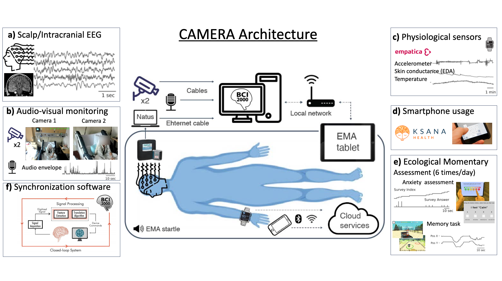
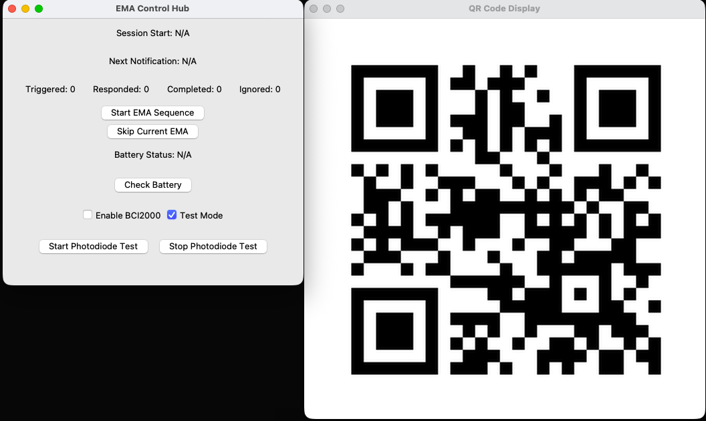

# CAMERA Platform


## Project Description

CAMERA (Context-Aware Multimodal Ecological Research and Assessment) is an NIH(National Institutes of Health)-funded,
open multimodal hardware and software platform designed to measure and model
human brain–behavior relationships in real-world environments. The platform integrates
neural, physiological, behavioral, environmental, and ecological momentary assessment
(EMA) data to enable continuous, high-resolution estimation of internal states such as
anxiety and cognitive performance.

A key innovation of CAMERA is its context-aware and adaptive EMA framework, in which
assessment timing is dynamically informed by a participant’s physiology and behavior.
By leveraging complementary multimodal data sources and interpretable machine learning
methods, CAMERA aims to improve both measurement fidelity and participant compliance
relative to existing approaches.

While initial development focuses on modeling anxiety state and memory performance,
CAMERA is designed as a flexible and extensible platform applicable to a broad range of
research questions involving complex human behavior and cognition.




[NIH Project Details](https://reporter.nih.gov/project-details/11004690)

*For more informations, please contact Dr. Brett E. Youngerman*

## Funding

This NIH-funded project is being developed in a phased R61/R33 framework.

## Use Cases

- Clinical EMU deployments
- Long-running BCI experiments
- Synchronized EEG and behavioral data collection

## Getting Started

### System Configuration

#### 1. Hardware Requirements

- **Host Computer - Windows**
  - AMD Ryzen 9 9900X 12-Core (4.4 to 5.6 GHz)
  - 32GB of 6000 MHz DDR5 RAM
  - NVIDIA GeForce RTX 5070 GPU (12GB GDDR7)
  - 2TB M.2 PCIe 4.0 SSD
  - Windows 11 Home

- **iPad**
  - iPadOS 12 or later

- **EEG System**
  - Natus EEG System

- **Networking**
  - TP-Link AXE5400 Tri-Band WiFi 6E Router (Archer AXE75)

- **Camera**
  - Logitech Brio PRO X 4K Webcam
  - Mevo Core UHD 4K Mirrorless Streaming Camera paired with an Olympus 14–42mm lens
    
- **Microphone**
  - RØDE NT55 Compact Condenser Microphone with Interchangeable Capsules

- **Speaker**
  - XKX Single USB Computer Speakers

- **Wearable Device**
  - [Empetica Embrace Plus](https://www.empatica.com/embraceplus/)
    
#### 2. Software Requirements

- [BCI2000](https://www.bci2000.org/mediawiki/index.php/Main_Page)
- [PyUnityLink - Python EMA Hub](https://github.com/CAMERA-BBQS/PyUnityLink)
- EMA iPad client
- [Empatica Care lab](https://apps.apple.com/us/app/empatica-care-lab/id6443699123)
- [Ksana Health - Effortless Assessment Research System (EARS)](https://ksanahealth.com/ears/)


#### 3. Tested/Verified Configuration

- [Windows PC](https://www.bhphotovideo.com/c/product/1885882-REG/cyberpowerpc_slcai7400cpgv2_gamer_supreme_liquid_cool.html/specs)
- [iPad Pro (11-inch, M2)](https://support.apple.com/en-us/118452), iPadOS 26.1
- [Unity 2022.3 LTS](https://unity.com/releases/editor/archive)
- [Python 3.9](https://www.python.org/downloads/release/python-390/)


### Setup

#### 1. Setup PyUnityLink on the Host PC
PyUnityLink serves as a Python-based orchestration hub, synchronizing control signals and data flow between BCI2000 and an iPad Unity client. It maintains comprehensive data logs in the /logs folder and provides an automated daily summary email to designated study participants or team members. Any system errors trigger immediate notification emails to ensure timely awareness.

1. Install **Python 3.9** and verify the installation:
   ```
   python --version
   ```
2. Clone and set up PyUnityLink:
   ```
   git clone https://github.com/CAMERA-BBQS/PyUnityLink.git
   ```
3. Install required Python dependencies as described in the PyUnityLink repository.

#### 2. Setup BCI2000 on the Host Computer

1. Install **BCI2000** following the [official documentation](https://www.bci2000.org/mediawiki/index.php/Programming_Howto:Building_and_Customizing_BCI2000).
2. Connect **Natus** to **BCI2000** following the [guide](https://www.bci2000.org/mediawiki/index.php/Contributions:NatusADC).
3. Verify that BCI2000 can successfully acquire EEG data from the Natus system by starting a new **Natus** study.
4. Configure event and state definitions in Bash start script which is required for synchronization with PyUnityLink. (Sample scripts are also provided in this repository)

#### 3. Network Configuration

To ensure reliable, low-latency communication and long-running stability, static local IP addresses should be assigned to all critical devices.

##### Router-Based IP Address Reservation (Recommended)

Static IP assignment is implemented via DHCP address reservation on the router, which
binds a fixed local IP address to each device’s MAC address.

1. Log in to the router administration interface (e.g., `http://tplinkwifi.net`).
2. Navigate to **Advanced > Network > DHCP Server**.
3. In the **Address Reservation** section, click **Add**.
4. Select the target device using **Scan**, or manually enter its MAC address.
5. Assign a specific IP address within the router’s subnet.
6. Save the configuration and reboot the device if required.

Repeat this process for all core system components, including:
- Host PC (EMA Control Hub)
- EMA iPad client (STAI-6 Anxiety Accessment and "Treasrue Hunt" Spacial Memory Task)
- Natus EEG acquisition system
- Any auxiliary acquisition or logging devices

##### Recommended IP Assignment Strategy

To simplify maintenance and troubleshooting, use a consistent IP addressing scheme,
for example:

- `192.168.0.101` — Host PC
- `192.168.0.102` — Natus Device
- `192.168.0.103` — iPad client

##### Verification

After configuration:
1. Confirm that each device consistently receives the assigned IP address.
   ```
   ping 192.168.0.101
   ```
3. Verify bidirectional communication between the EMA control hub and the iPad client.
4. Confirm stable, low-latency operation during extended test runs and data recording. (PyUnityLink also keeps a copy of the latency logs during the study.)

#### 4. Install EMA iPad Client - STAI6 survey and "Treasrue Hunt" Memory Task

1. Install the EMA iPad client via [TestFlight](https://apps.apple.com/us/app/testflight/id899247664).
2. Ensure the iPad is connected to the same local Wi-Fi network as the host computer.
3. Disable auto-lock and background app refresh to support long-running sessions.
4. [Guided Access](https://support.apple.com/en-us/111795) mode is recommended to prevent unintended user interaction; the application is fully compatible with Guided Access.

#### 5. Setup Empatica Wrisband - Embrace Plus

The Empatica Embrace Plus wearable is used to collect continuous physiological data
(e.g., electrodermal activity, heart rate, temperature, and accelerometry).

1. Charge the Empatica Embrace Plus device fully before deployment.
2. Install the **Empatica Care Lab** application on a mobile device.
3. Pair the wearable with the Care Lab application following Empatica’s official instructions.
4. Assign the device to the appropriate study or participant profile.
5. Verify that physiological signals are being recorded and streamed or logged correctly.
6. Ensure the wearable is time-synchronized with the host system prior to experimental sessions.

During long-running deployments, periodically verify battery status and data continuity using the Empatica Care Lab dashboard.

#### Setup Ksana Health - Effortless Assessment Research System (EARS)

Ksana Health’s Effortless Assessment Research System (EARS) is used to collect
smartphone-based behavioral, linguistic, and ecological momentary assessment (EMA) data.

1. Install the **Ksana Health – EARS** application on the participant’s smartphone.
2. Configure the study protocol and EMA schedule via the Ksana research dashboard.
3. Assign the participant to the appropriate study configuration.
4. Ensure timestamps and device clocks are aligned with the rest of the CAMERA platform.

Data collected via EARS are later synchronized with neural, physiological, and behavioral
data streams during offline analysis.

#### 5. Peripheral Devices

1. Ensure all system drivers are up to date.
2. Connect and configure cameras, microphones, speakers, and wearable devices according to vendor instructions.
3. Verify that all devices are recognized by the host system and functioning correctly.

### Running the System

1. Start **BCI2000** and confirm EEG signal acquisition.
2. Launch the Python controller on the host computer.
3. Start the iPad client and wait for a successful connection to the controller.
4. Use the Python controller interface to initiate sessions and trigger experimental events.
   
5. Monitor logs on both the host computer and iPad to verify proper synchronization and data recording.
6. Study log files are kept in "PyUnityLink/logs" folder, and the system automatically generates and emails a daily summary to specified recipients.
   


## Repositories

| Component | Repository | Description |
|---------|------------|-------------|
| Python EMA Control Hub | [`PyUnityLink`](https://github.com/CAMERA-BBQS/PyUnityLink) | Orchestrates sessions, triggers events, and synchronizes data |
| EMA iPad Client | `TH-ipad` | Unity-based experimental task (STAI-6 Anxiety Accessment and "Treasrue Hunt" Spacial Memory Task) running on iPad |

## Contributors

### Principal Investigators

- Dr. Brett E. Youngerman
- Dr. Joshua Jacobs
- Dr. Jorge Jose Ortiz
- Dr. Alik S. Widge

### System Development & Data Analysis

- Ehsan, Taqiya, MS — Audio data processing and multimodal predictive modeling
- Li, Yangjia (Francis), MS - System architecture design and development
- Xia, Shuren, MS — Video data processing and multimodal predictive modeling
- Han, Zhixian (Claire), MS — Spatial navigation and memory data analysis
- Wang, Linda, MD — STAI-6 (Spielberger State-Trait Anxiety Inventory) data analysis
- Zhao, Chongkun, MS — Empatica & Kasana data analysis and linguistic feature engineering
- Zhu, Hongkun, PhD — Data preprocessing, multimodal synchronization, and biomarker discovery

## License

Unless otherwise noted, repositories under this organization are released under the Apache License, Version 2.0.
Individual repositories may include additional licensing terms; please refer to each repository's LICENSE file.

## To-do


